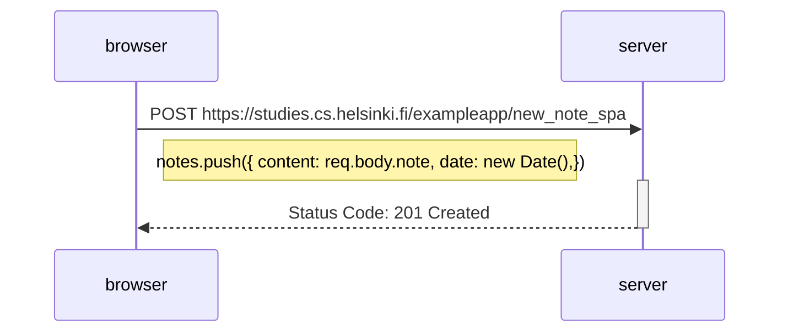

```mermaid
sequenceDiagram
    participant browser
    participant server

    browser->>server: POST https://studies.cs.helsinki.fi/exampleapp/new_note_spa

    Note right of browser: notes.push({ content: req.body.note, date: new Date(),})

    activate server
    server-->>browser: Status Code: 201 Created
    deactivate server

```